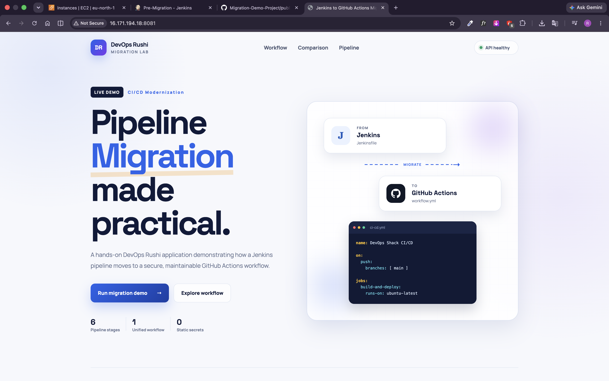
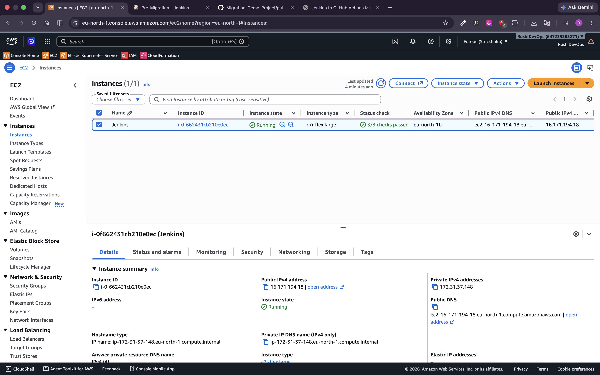
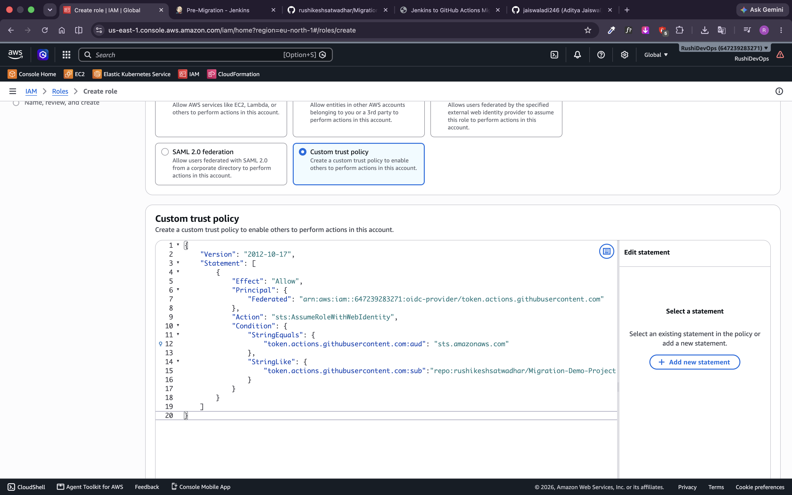
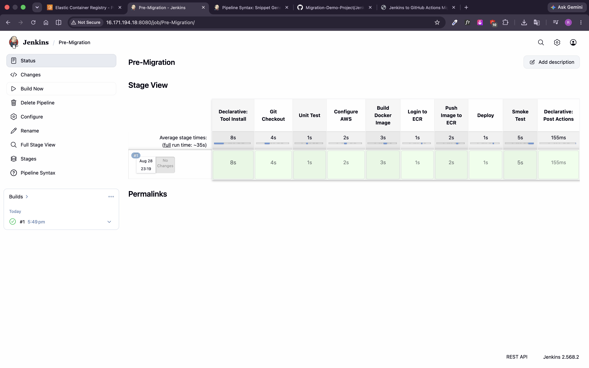
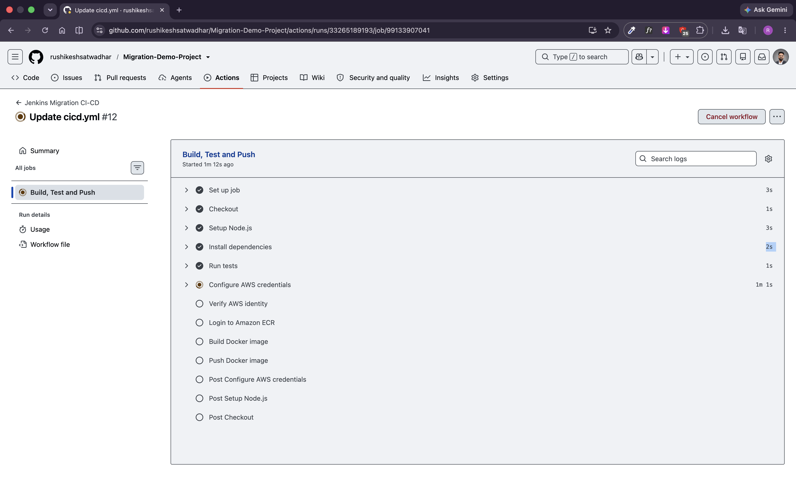

# 🚀 Jenkins to GitHub Actions Migration

### Jenkins → GitHub Actions → Amazon ECR → Amazon EC2

---

## 📌 Project Overview

This project demonstrates migrating a **Jenkins CI/CD pipeline to GitHub Actions**.

The application is containerized using **Docker**, stored in **Amazon ECR**, and deployed on **Amazon EC2**.

---

### 🔄 Project Flow

GitHub → Jenkins → Docker → Amazon ECR → Amazon EC2 → Application

After Migration:

GitHub → GitHub Actions → Docker → Amazon ECR → Amazon EC2 → Application

---

## 🏗️ End-to-End DevOps Architecture

```text
                 👨‍💻 Developer
                       │
                       ▼
                🐙 GitHub Repository
                       │
              ┌────────┴────────┐
              ▼                 ▼
        🔧 Jenkins        ⚡ GitHub Actions
       Existing CI/CD       Migrated CI/CD
              │                 │
              └────────┬────────┘
                       ▼
                 🐳 Docker Build
                       │
                       ▼
                  📦 Amazon ECR
                 Docker Registry
                       │
                       ▼
              🔐 AWS Systems Manager
                       │
                       ▼
                 🖥️ Amazon EC2
                Deployment Server
                       │
                       ▼
                🐳 Docker Container
                       │
                       ▼
                 🌐 Application
                       │
                       ▼
                 ✅ Health Check
                       │
                       ▼
             🚀 Deployment Successful
```
---

## Repository structure

```text
Migration-Demo-Project-main/
├── .github/
│   └── workflows/
│       └── cicd.yml          # Migrated GitHub Actions CI/CD pipeline
├── public/
│   ├── app.js                # Interactive migration workflow UI
│   ├── index.html            # DevOps Shack migration dashboard
│   └── styles.css            # Application styling
├── .dockerignore             # Docker build exclusions
├── Dockerfile                # Node.js 22 production image
├── Jenkinsfile               # Original Jenkins pipeline
├── package.json              # Application scripts and dependencies
├── server.js                 # Express server and API endpoints
├── test.js                   # Automated health, UI and API tests
└── README.md                 # DevOps project documentation
```
---

## Pipeline workflow

### GitHub Actions Workflow at a Glance

```text
┌──────────────────────┐
│  Push / Pull Request │
└──────────┬───────────┘
           │
           ▼
┌──────────────────────┐
│  Build & Test        │
│  Docker Build        │
└──────────┬───────────┘
           │
           ▼
┌──────────────────────┐
│     Amazon ECR       │
│   Push Docker Image  │
└──────────┬───────────┘
           │
           ▼
┌──────────────────────┐
│     Deploy to EC2    │
│  AWS Systems Manager │
└──────────┬───────────┘
           │
           ▼
┌──────────────────────┐
│     Smoke Test       │
│     /health          │
└──────────┬───────────┘
           │
           ▼
        ✅ Success
```

The migrated workflow is defined in [`.github/workflows/cicd.yml`](.github/workflows/cicd.yml) and contains two dependent jobs.

### Job 1 — Build, Test and Push

Runs on a GitHub-hosted Ubuntu runner.

| Order | Workflow step | What happens |
|---:|---|---|
| 1 | Checkout | Downloads the repository onto the runner |
| 2 | Set up Node.js | Installs Node.js 22 |
| 3 | Install dependencies | Runs `npm install` |
| 4 | Run tests | Executes `npm test` |
| 5 | Configure AWS credentials | Assumes an IAM role through GitHub OIDC |
| 6 | Verify AWS identity | Runs `aws sts get-caller-identity` |
| 7 | Log in to ECR | Retrieves the registry URL and authenticates Docker |
| 8 | Build image | Builds the application image from the `Dockerfile` |
| 9 | Push image | Pushes the `${{ github.sha }}` tagged image to ECR |

### Job 2 — Deploy to Application EC2

The deployment job uses `needs: build-test-push`, so it starts only after the CI job succeeds.

| Order | Workflow step | What happens |
|---:|---|---|
| 1 | Configure AWS credentials | Assumes the deployment IAM role through OIDC |
| 2 | Send SSM command | Runs the deployment remotely on the EC2 instance |
| 3 | Authenticate to ECR | Allows the EC2 host to pull the private image |
| 4 | Pull image | Downloads the exact commit-tagged image |
| 5 | Replace container | Stops and removes `app`, then starts the new container |
| 6 | Wait for SSM | Blocks until the remote command completes |
| 7 | Smoke test | Calls `http://<EC2_PUBLIC_IP>:8082/health` |

### Image lifecycle

```text
Source commit
   → GitHub SHA image tag
   → Amazon ECR repository
   → EC2 Docker pull
   → app container
   → /health verification
```

Using `${{ github.sha }}` makes every GitHub Actions image traceable to the exact source commit that produced it.

---

## Jenkins-to-GitHub Actions mapping

The migration preserves the delivery logic while replacing Jenkins-specific constructs with GitHub-native equivalents.

| Jenkins | GitHub Actions | Migration meaning |
|---|---|---|
| `Jenkinsfile` | `.github/workflows/cicd.yml` | Pipeline as code remains in the repository |
| `pipeline {}` | Workflow YAML | Top-level pipeline definition |
| `agent any` | `runs-on: ubuntu-latest` | Selects the execution environment |
| `tools { nodejs 'nodejs22' }` | `actions/setup-node` | Installs Node.js 22 |
| `environment {}` | `env:` | Defines shared environment variables |
| `stages {}` | `jobs:` and `steps:` | Organizes the delivery lifecycle |
| `stage('Test')` | `Run tests` step | Runs the same automated test command |
| `checkout scm` | `actions/checkout` | Retrieves source code |
| `${BUILD_NUMBER}` | `${{ github.sha }}` | Creates a unique image version |
| Jenkins/AWS agent credentials | GitHub OIDC role assumption | Replaces persistent credentials with short-lived access |
| Shell deployment on agent | SSM command from deploy job | Separates the CI runner from the target server |
| `post { success/failure }` | Job status and logs | Reports workflow outcome |

### What changes and what remains unchanged

| Changes during migration | Remains unchanged |
|---|---|
| Pipeline orchestrator | Application source code |
| Pipeline syntax | Node.js runtime contract |
| Runner/agent model | Dockerfile and container port `8080` |
| Credential delivery mechanism | Amazon ECR image registry pattern |
| Remote deployment mechanism | Existing EC2 deployment server |
| Pipeline visibility and logs | Health endpoint and smoke-test goal |

> The sample Jenkins and GitHub Actions files currently use different ECR repository names. For a strict like-for-like migration, configure both pipelines to publish to the same approved ECR repository, or intentionally keep separate repositories during parallel validation.

---
## 📸 Project Screenshots

### 🌐 Running Application

The application is successfully deployed and running on AWS EC2.



---

### 🖥️ Amazon EC2 Instance

EC2 instance used as the application deployment server.



---

### 🔐 AWS IAM Role

IAM role configured for GitHub Actions to securely access AWS using OIDC.



---

### 🔧 Jenkins Pipeline

Original Jenkins CI/CD pipeline running successfully.



---

### ⚡ GitHub Actions Pipeline

Migrated GitHub Actions workflow successfully building and deploying the application.



---
**Learn. Build. Automate.**
